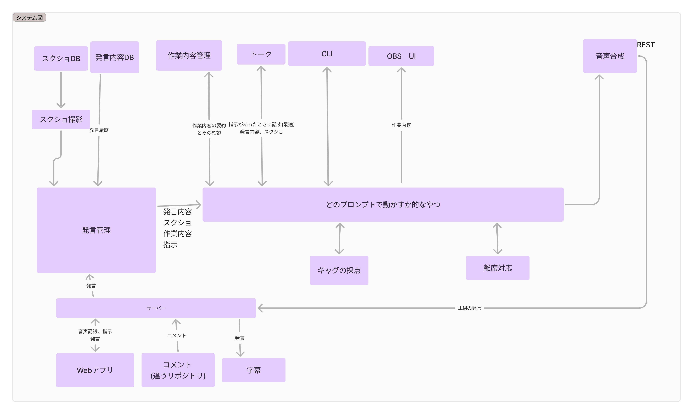

# ai-vtuber

ふぐおが開発しているAI Tuberのプロジェクトです。  
不定期でリポジトリはpublicになったり、privateになったりします。  
私の気分次第なので、ご了承ください。  

## さらっとした概要(2024年)

[https://speakerdeck.com/boxfish/yan-jiu-bao-gao-feng-2024nian-ai-tuberhuo-dong-matome](https://speakerdeck.com/boxfish/yan-jiu-bao-gao-feng-2024nian-ai-tuberhuo-dong-matome)

## 現在できること

- コメントの取得
- 音声認識
- webアプリを使った発言タイミングのコントロールと話題の管理
- voicevoxを使った音声合成
- 自動で発話を行う
- 会話履歴の保存
- システムプロンプト、入力例、出力例の設定
- 会話履歴の切れ目を自動で設定
- 画面のスクショをとり、AIに提示
- 配信外にていつでもどこでもプロンプトエンジニアリングできるwebアプリ

## アバターなど
AI Tuberなのにアバターを動かす部分はありません。  
現状はこだわっている場合ではないので、アバターはありません。  
アバター付きで動かしたい場合は、VBCableやVtube Studioを使えばある程度それっぼいことはできます。  

## ディレクトリ構成

### ai_vtuber
メインのコード、hono, langchain, prisma, sqliteなどを使用

この図のプログラムの音声再生、コメント取得、音声認識等以外  

  

### api
cloudflareにデプロイしてるスクショを保存、urlで閲覧するプログラム。
hono, cloudflare R2を使用

### front_end
AI Tuberコントロールアプリ。音声認識もしてる。
vite, react, tailwind css, shadcnを使用

### llm
プロンプトエンジニアリングをするためのアプリ。ゴロゴロしながら、AIちゃんのプロンプトを練りたいと思ってつくったけど、あんまり使ってない
next.js, prisma, postgress, vercel AI sdkを使用。デプロイ先、DBはVercel。

## comment
ニコニコのコメントを取得し、それをrestapiサーバーに投げる

### player
restサーバーが立ち上がり、音声データを受け取ったら、それを再生するだけ。

### endpoint.json
サーバーのアドレスとポート番号の指定

## 動かし方
ai_vtuber, front_end, comment, playerのディレクトリにそれぞれ移動して、以下のコマンドを実行してください。

```bash
pnpm i
pnpm run dev
```
